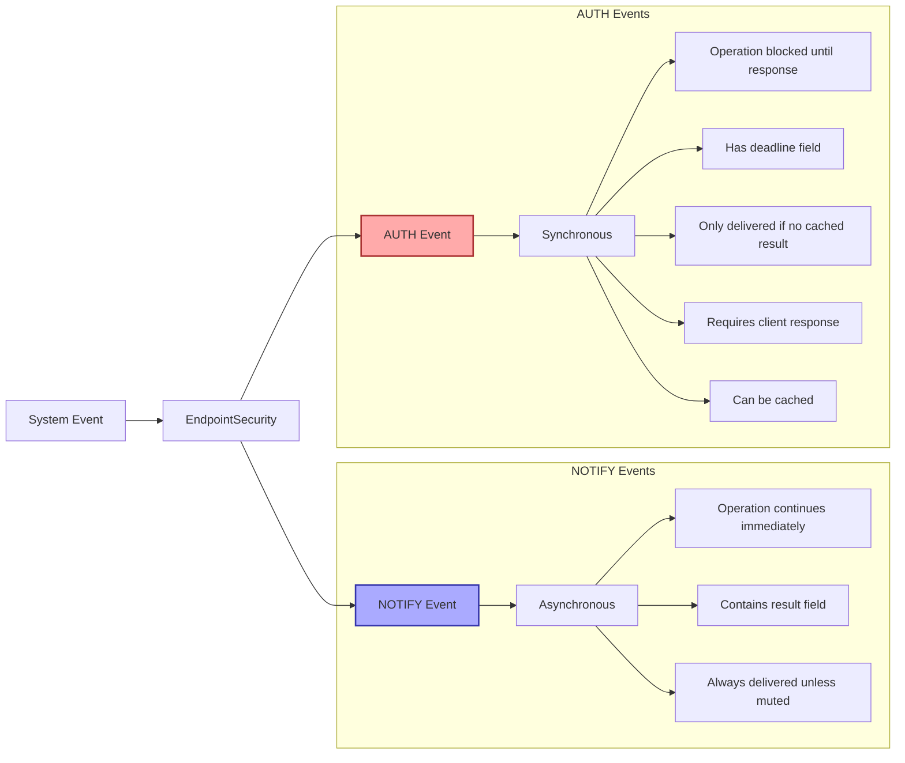
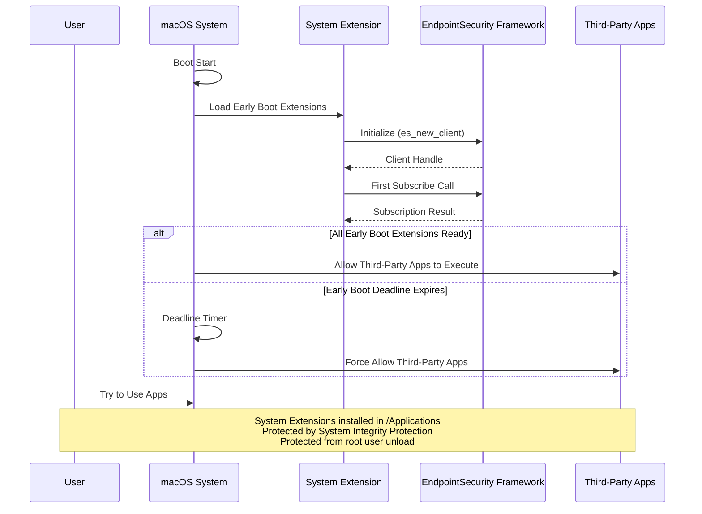
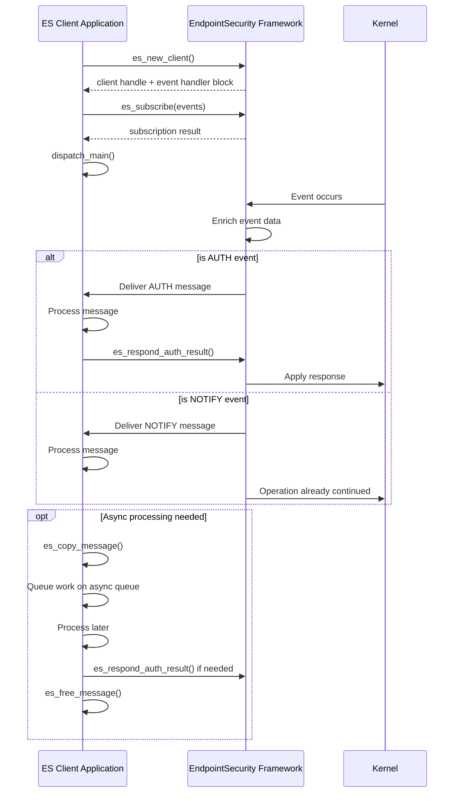
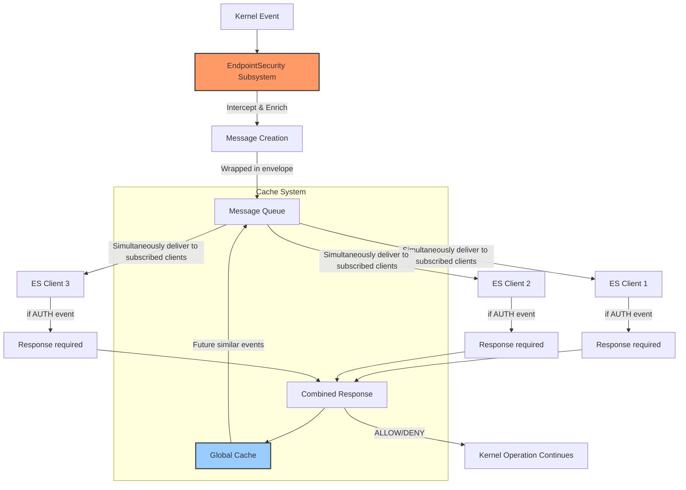

# EndpointSecurity API Documentation

This repository contains documentation and diagrams about Apple's EndpointSecurity API framework, which provides system event monitoring and security capabilities on macOS.

## Diagrams

### EndpointSecurity Event Types



This diagram illustrates the two main types of EndpointSecurity events: NOTIFY and AUTH events, and their key differences.

### EndpointSecurity Early Boot Process



This sequence diagram shows how EndpointSecurity extensions are loaded during the early boot process and how they interact with the system.

### EndpointSecurity Client Flow



This diagram demonstrates the typical flow of an EndpointSecurity client application, from initialization to event handling.

### EndpointSecurity Caching System

```mermaid
flowchart TD
    E[Event Occurs] --> CE{Cached Entry Exists?}

    CE -->|Yes| CMP{Compare with Cache}
    CE -->|No| D[Deliver to Clients]

    CMP -->|Match| AR[Apply Cached Result]
    CMP -->|No Match| D

    D --> MULTI{Multiple Clients?}

    MULTI -->|Yes| C1[Client 1 Response]
    MULTI -->|Yes| C2[Client 2 Response]
    MULTI -->|No| SR[Single Response]

    C1 --> COMB[Combine Responses]
    C2 --> COMB

    COMB --> MR[Most Restrictive Rule Applied]
    SR --> FR[Final Response]
    MR --> FR

    FR -->|cache=true| ADDCACHE[Add to Cache]
    FR -->|cache=false| NOCACHE[Skip Cache]

    ADDCACHE --> RET[Return Result to Kernel]
    NOCACHE --> RET
    AR --> RET

    subgraph "Cache Invalidation"
        INV[File Modified/Deleted]
        CONNECT[New Client Connects]
        DISCONNECT[Client Disconnects]
        CLEAR[es_clear_cache() Called]

        INV --> INVC[Invalidate Cache Entry]
        CONNECT --> INVC
        DISCONNECT --> INVC
        CLEAR --> INVC
    end

    style ADDCACHE fill:#9cf,stroke:#333,stroke-width:2px
    style INVC fill:#f99,stroke:#333,stroke-width:2px
```

This flowchart explains how the EndpointSecurity caching system works to improve performance and reduce redundant event processing.

### EndpointSecurity Architecture



This diagram provides an overview of the EndpointSecurity subsystem architecture and how events flow through the system.

## Notes

- The diagrams are created using Mermaid syntax and can be viewed directly in GitHub.
- For an interactive experience with these diagrams in Obsidian, clone this repository and open it as an Obsidian vault.
