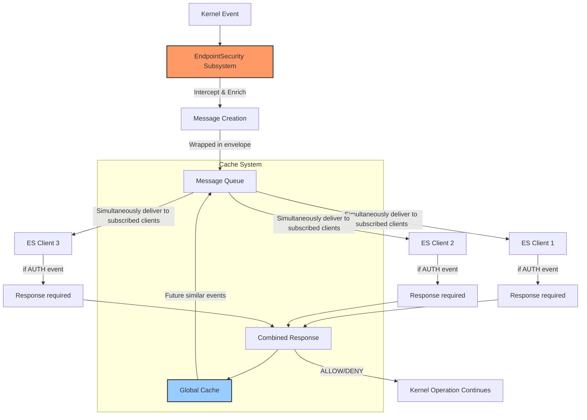
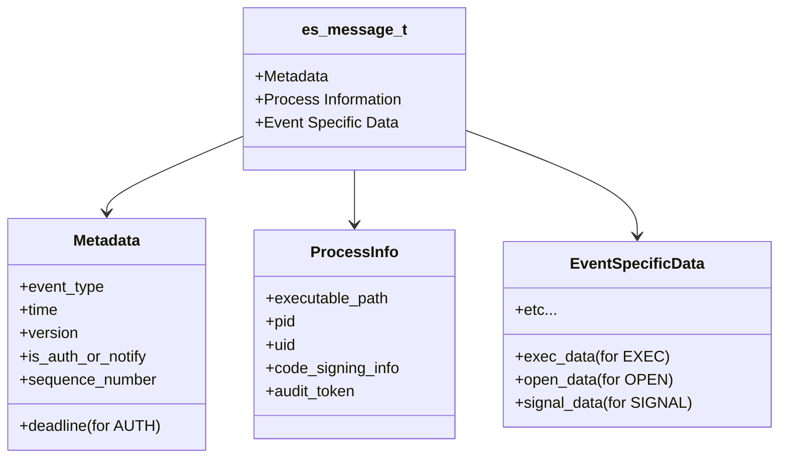
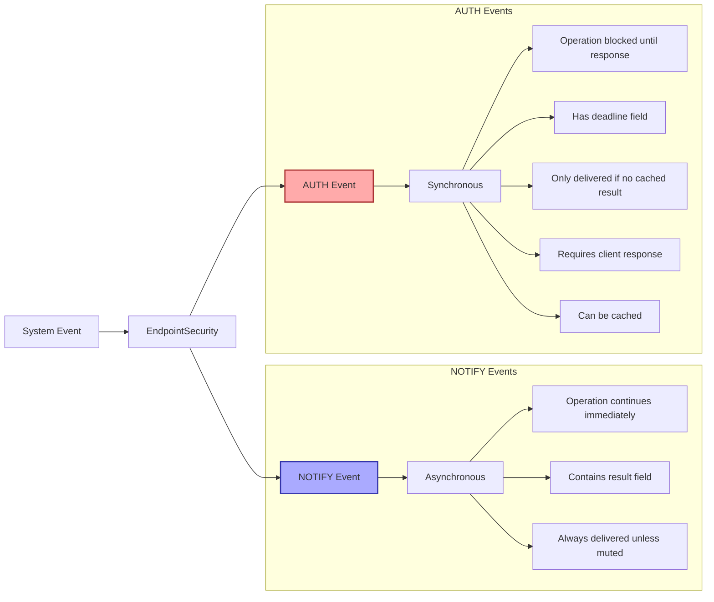
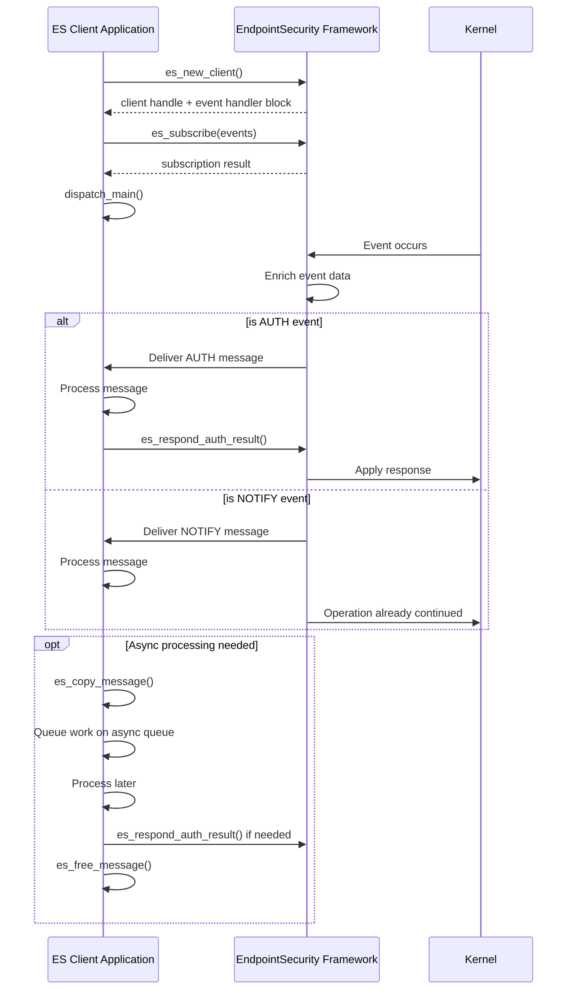
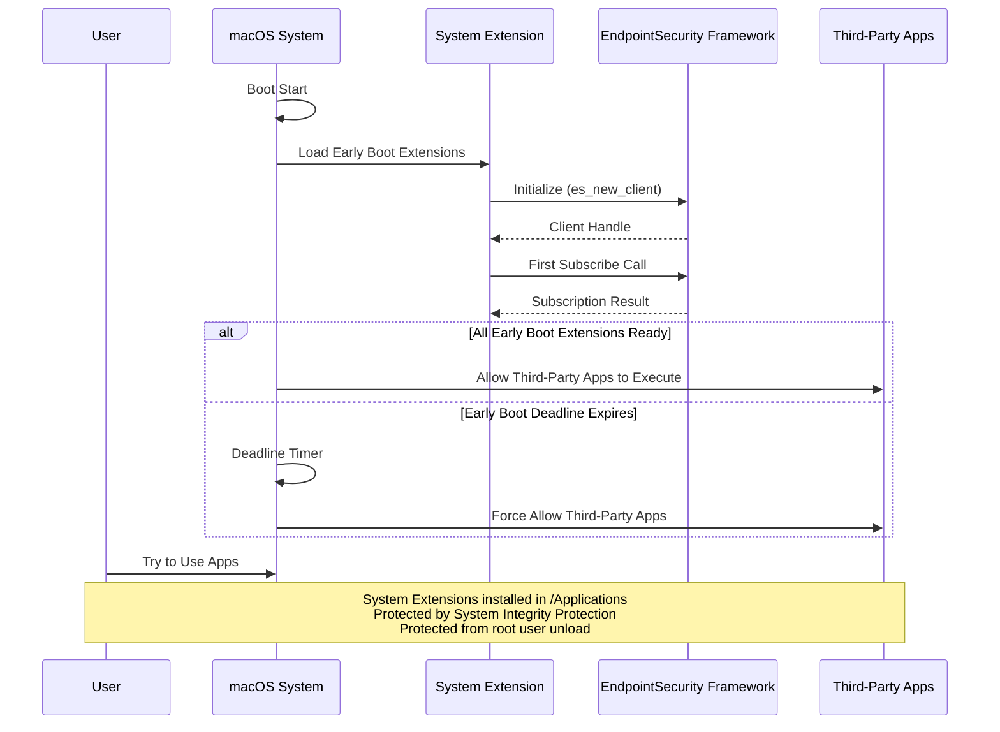

# EndpointSecurity Framework Documentation

This repository contains comprehensive documentation and visualizations for Apple's EndpointSecurity Framework, which provides system event monitoring and security capabilities on macOS.

## Overview

The EndpointSecurity Framework (introduced in macOS Catalina) is designed as a modern replacement for:
- Kernel Extensions (KEXTs)
- Kauth KPI
- Unsupported Mac kernel framework
- OpenBSM audit trail

It allows security products to monitor and control system events from user space without kernel extensions, improving system stability and security.

## Core Concepts Visualized

### EndpointSecurity Architecture



### Message Structure



### AUTH vs NOTIFY Events



### Client Initialization and Event Flow



### Caching and Response Mechanism

```mermaid
flowchart TD
    E[Event Occurs] --> CE{Cached Entry Exists?}

    CE -->|Yes| CMP{Compare with Cache}
    CE -->|No| D[Deliver to Clients]

    CMP -->|Match| AR[Apply Cached Result]
    CMP -->|No Match| D

    D --> MULTI{Multiple Clients?}

    MULTI -->|Yes| C1[Client 1 Response]
    MULTI -->|Yes| C2[Client 2 Response]
    MULTI -->|No| SR[Single Response]

    C1 --> COMB[Combine Responses]
    C2 --> COMB

    COMB --> MR[Most Restrictive Rule Applied]
    SR --> FR[Final Response]
    MR --> FR

    FR -->|cache=true| ADDCACHE[Add to Cache]
    FR -->|cache=false| NOCACHE[Skip Cache]

    ADDCACHE --> RET[Return Result to Kernel]
    NOCACHE --> RET
    AR --> RET

    subgraph "Cache Invalidation"
        INV[File Modified/Deleted]
        CONNECT[New Client Connects]
        DISCONNECT[Client Disconnects]
        CLEAR[es_clear_cache() Called]

        INV --> INVC[Invalidate Cache Entry]
        CONNECT --> INVC
        DISCONNECT --> INVC
        CLEAR --> INVC
    end

    style ADDCACHE fill:#9cf,stroke:#333,stroke-width:2px
    style INVC fill:#f99,stroke:#333,stroke-width:2px
```

### System Extension and Early Boot Process



## Key Features

### Event Types
- **NOTIFY Events**: Informational events that tell you an operation is happening
- **AUTH Events**: Control events that allow you to approve or deny operations

### Implementation Benefits
- C library for performance and compatibility (callable from Swift, Objective-C, Rust)
- No kernel extension required
- Enhanced system stability and security
- Rich event stream (~100 event types)

### Security Enhancements
- System Extension provides System Integrity Protection
- Protection from root user tampering
- Early boot capability for security initialization before third-party apps

### Performance Considerations
- Caching mechanism to improve performance
- Message muting to reduce event volume
- Asynchronous processing recommended for AUTH events
- Response deadlines must be respected

## Getting Started

### Requirements
- Endpoint Security entitlement (restricted, requires approval)
- Full Disk Access permissions (for privacy)
- System Extension entitlement (if deployed as system extension)
- User approval for installation

### Basic Implementation Flow
1. Initialize client with `es_new_client()`
2. Set up event handler block
3. Subscribe to events with `es_subscribe()`
4. Process events in handler block
5. For AUTH events, respond before deadline expires

### Best Practices
- Avoid time-of-check time-of-use issues
- Use message muting to reduce event volume
- Use caching for performance, not policy
- Process messages asynchronously when possible
- Split subscriptions across multiple clients if needed

## Usage in Obsidian

The Mermaid diagrams in this README are compatible with Obsidian and can be viewed directly in your Obsidian vault. Place this README in your vault and the diagrams will render automatically.

For Obsidian usage, you can save these diagrams in separate files:
- `assets/mermid/es-architecture.mermaid`
- `assets/mermid/es-message-structure.mermaid`
- `assets/mermid/es-event-types.mermaid`
- `assets/mermid/es-client-flow.mermaid`
- `assets/mermid/es-caching.mermaid`
- `assets/mermid/es-early-boot.mermaid`

Then reference them in your Obsidian notes using:
```
![[assets/mermid/es-architecture.mermaid]]
```

## References

- [Apple Developer Documentation](https://developer.apple.com/documentation)
- [WWDC Session: Build an Endpoint Security app](https://developer.apple.com/videos/play/wwdc2020/)
- [System Extensions and DriverKit](https://developer.apple.com/videos/play/wwdc2019/)

## Notes

This documentation is based on the EndpointSecurity Framework as described in WWDC presentations and official documentation. The framework continues to evolve with new macOS releases, adding events and capabilities.
